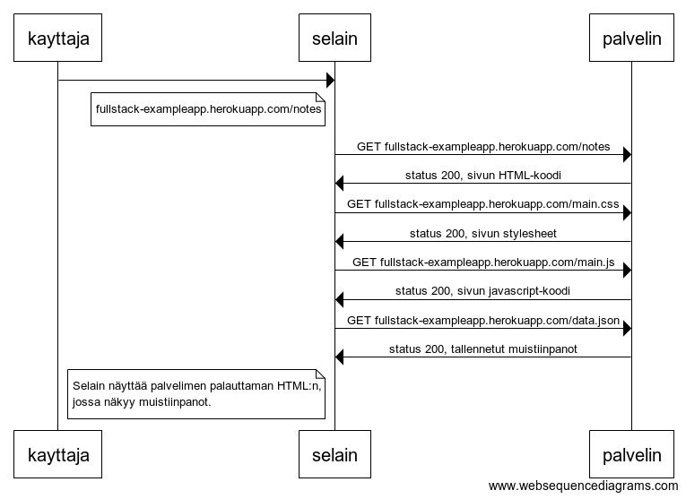
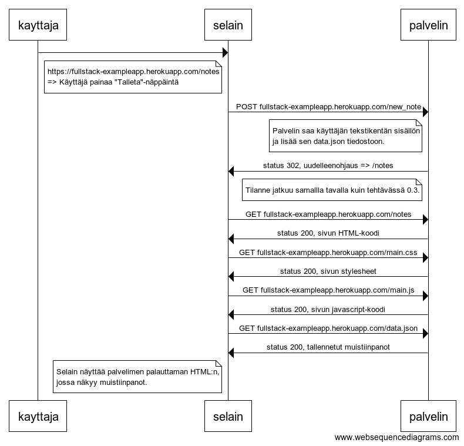
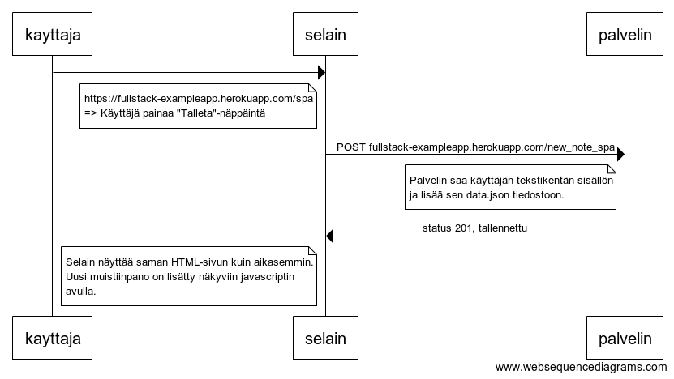

## 0.3




```
kayttaja->selain:
note left of selain
fullstack-exampleapp.herokuapp.com/notes
end note

selain->palvelin: GET fullstack-exampleapp.herokuapp.com/notes
palvelin->selain: status 200, sivun HTML-koodi
selain->palvelin: GET fullstack-exampleapp.herokuapp.com/main.css
palvelin->selain: status 200, sivun stylesheet
selain->palvelin: GET fullstack-exampleapp.herokuapp.com/main.js
palvelin->selain: status 200, sivun javascript-koodi
selain->palvelin: GET fullstack-exampleapp.herokuapp.com/data.json
palvelin->selain: status 200, tallennetut muistiinpanot

note left of selain
 Selain näyttää palvelimen palauttaman HTML:n, 
 jossa näkyy muistiinpanot.
end note
```

## 0.4



```
kayttaja->selain:
note left of selain
https://fullstack-exampleapp.herokuapp.com/notes
=> Käyttäjä painaa "Talleta"-näppäintä
end note

selain->palvelin: POST fullstack-exampleapp.herokuapp.com/new_note
note left of palvelin
Palvelin saa käyttäjän tekstikentän sisällön 
ja lisää sen data.json tiedostoon.
end note
palvelin->selain: status 302, uudelleenohjaus => /notes
note left of palvelin
Tilanne jatkuu samallla tavalla kuin tehtävässä 0.3.
end note

selain->palvelin: GET fullstack-exampleapp.herokuapp.com/notes
palvelin->selain: status 200, sivun HTML-koodi
selain->palvelin: GET fullstack-exampleapp.herokuapp.com/main.css
palvelin->selain: status 200, sivun stylesheet
selain->palvelin: GET fullstack-exampleapp.herokuapp.com/main.js
palvelin->selain: status 200, sivun javascript-koodi
selain->palvelin: GET fullstack-exampleapp.herokuapp.com/data.json
palvelin->selain: status 200, tallennetut muistiinpanot

note left of selain
 Selain näyttää palvelimen palauttaman HTML:n, 
 jossa näkyy muistiinpanot.
end note
```

## 0.5


```
kayttaja->selain:
note left of selain
fullstack-exampleapp.herokuapp.com/spa
end note

selain->palvelin: GET fullstack-exampleapp.herokuapp.com/spa
palvelin->selain: status 200, sivun HTML-koodi
selain->palvelin: GET fullstack-exampleapp.herokuapp.com/main.css
palvelin->selain: status 200, sivun stylesheet
selain->palvelin: GET fullstack-exampleapp.herokuapp.com/spa.js
palvelin->selain: status 200, sivun javascript-koodi
selain->palvelin: GET fullstack-exampleapp.herokuapp.com/data.json
palvelin->selain: status 200, tallennetut muistiinpanot

note left of selain
 Selain näyttää palvelimen palauttaman HTML:n, 
 jossa näkyy muistiinpanot.
end note
```

## 0.6



```
kayttaja->selain:
note left of selain
https://fullstack-exampleapp.herokuapp.com/spa
=> Käyttäjä painaa "Talleta"-näppäintä
end note

selain->palvelin: POST fullstack-exampleapp.herokuapp.com/new_note_spa
note left of palvelin
Palvelin saa käyttäjän tekstikentän sisällön 
ja lisää sen data.json tiedostoon.
end note
palvelin->selain: status 201, tallennettu

note left of selain
 Selain näyttää saman HTML-sivun kuin aikasemmin.
 Uusi muistiinpano on lisätty näkyviin javascriptin 
 avulla.
end note
```